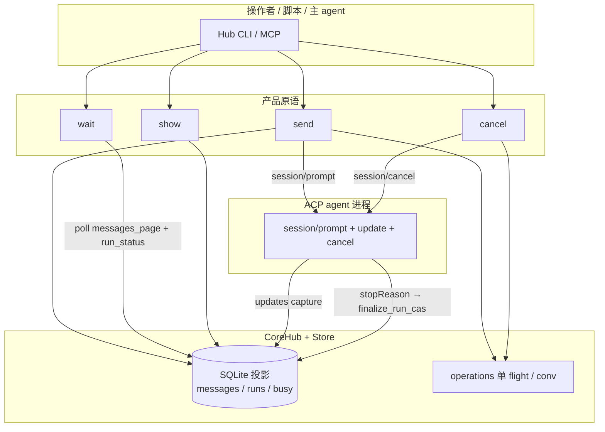
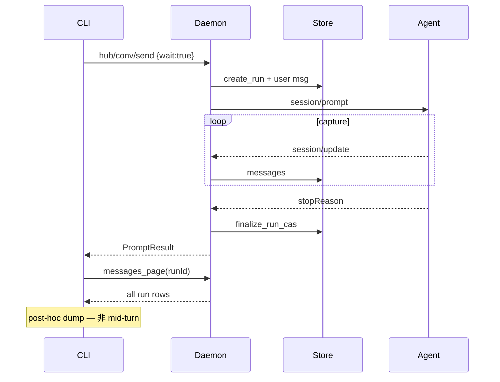
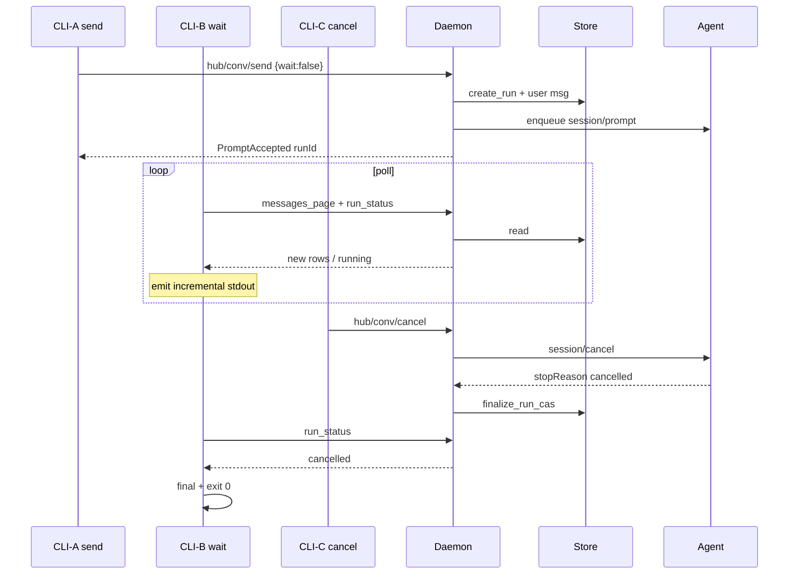
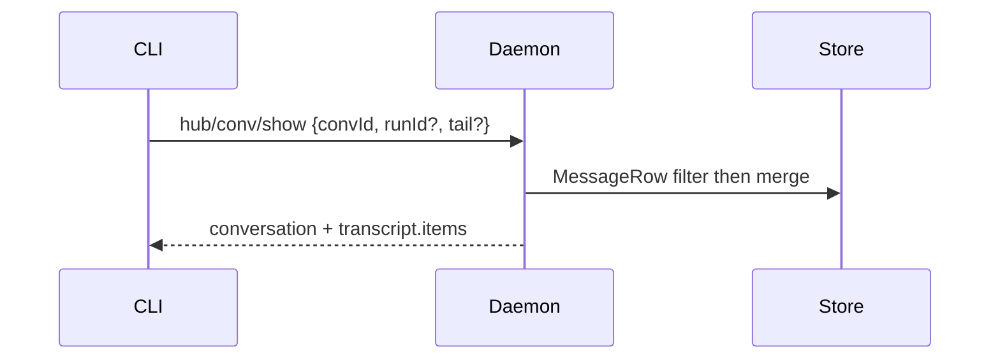

# UX-CORE — ACP Hub 产品表面 SSOT（v1.0）

| 字段 | 值 |
|------|-----|
| **文档 ID** | `UX-CORE` |
| **版本** | `1.0` (rev.3 — shipped) |
| **作者** | agent-managed / design |
| **日期** | 2026-07-25 |
| **状态** | **SHIPPED on main**（PR #55 + skeptic follow-up）— 实现与本文 + HUMAN-READING 对齐 |
| **性质** | **产品表面 SSOT**（操作原语 · 信息架构 · CLI/MCP 签名 · 验收） |
| **基线证据** | `doc/dev/feedback-book-send-wait-show-2026-07-25.md` · 源码 `crates/cli/` · `crates/hub/src/hub/{prompt,wait}.rs` · main PR #55 |

**权威关系（必读）：**

| 文档 | 与 UX-CORE 的关系 |
|------|-------------------|
| **本文 UX-CORE** | **产品表面唯一 SSOT**（人与操作者 agent「记什么、怎么用」） |
| [HUMAN-READING.md](./HUMAN-READING.md) | **仍有效** — 默认 CLI 呈现法（非方言） |
| [pillars/Product-UX.md](./pillars/Product-UX.md) | **仍有效（架构法）** — Store-first、auto-allow、Option A RO、可用性优先；**产品动线表面指向本文** |
| [OPERATOR-UX-SYSTEM.md](./OPERATOR-UX-SYSTEM.md) / CHARTER / PHASE1–4 / SHIP | **历史实现笔记**；**产品表面由 UX-CORE 取代**。PHASE 合同中与 wire/schema 仍相关的部分可作实现参考，但**不得再扩展**为操作者心智模型或 doctor 主叙事 |
| `doc/dev/feedback-book-send-wait-show-2026-07-25.md` | 设计种子与证据；落地后以本文为准 |

> **实现状态（main）：** CLI/MCP 已暴露四原语；doctor / help 为四原语冷启；`send --no-wait`、`wait`、show 过滤器已落地。并行债（daemon 自愈 F-1、Cursor delete F-3、配置 RPC 超时 F-7）仍非本表面范围。

---

## 1. Overview

**问题：**  
rc.4 底座已能当 ACP Client（`session/prompt` → updates → final `stopReason` → `finalize_run`），但操作表面把「投递」和「守听」粘在 `send` 里；`show` 过滤器不足；OPERATOR-UX 用 SC / Phase / F-\* 把心智模型撑到不可记。全量复测证明：主路径可真用，**缺口是原语切分与可靠 attach/回看**，不是重做协议。

**方案：**  
**完全放弃**旧多旅程 OPERATOR-UX 作为产品表面。产品表面收敛为 **三个正交原语 + 一个控制**：

```text
send   —— 投递 prompt（默认仍阻塞到终态 ≡ 今日；支持 --no-wait）
wait   —— 附着 in-flight（或已结束）run，增量读 Store 直到终态（不发新 prompt）【新】
show   —— 任意时刻读完整 / 最近 / 片段对话（人读默认必须有正文；#53 已修空 BODY）
cancel —— 打断 in-flight（已有，与 wait 正交）
```

其余命令保留，但收进 **最多 3 个心智文件夹**（见 §5），不再用 16 个 F-\* 当日常词汇。  
**一个连贯产品模型**；实现可分期，**叙事不得再写「Phase1 exit 即完成」**。

---

## 2. Background & Motivation

### 2.1 当前状态（代码事实 — main 已实现）

| 面 | 现状 | 路径 |
|----|------|------|
| CLI 树 | `serve` / `agent` / `proxy` / `conv` / `send` / **`wait`** / `param` / `mode` / `cancel` / `search` / `doctor` / `mcp` | `crates/cli/src/args.rs` |
| `send` | `--text\|--stdin`、`--param`、`--mode`、`--json`、**`--no-wait` / `--wait`** | `SendArgs` |
| `send` 默认 | RPC `hub/conv/send`（`wait=true`）阻塞至 `finalize_run`；CLI **之后** post-hoc `messages_page` dump | `prompt.rs` · `handle_send` |
| `send --no-wait` | accepted 后立即返回 `{runId,promptSeq,busy=running}`；**不** dump | 同上 |
| `wait` | 顶层；`HubClient::wait_run` / `CoreHub::wait_run` Store-poll | `hub/wait.rs` · `handle_wait` · MCP `wait_run` |
| `cancel` | 顶层；与 wait 正交 | `handle_cancel` |
| `conv show` | `--raw` / `--json` + **tail/head/seq/run/kinds/no-tools/max-chars** | `ShowConversationParams` |
| show 正文 | camelCase `bodyText` + full stream（#53） | `output.rs` |
| ViewMessage | `{seq, role, kind, bodyText, source, mergedCount}` — **无强制 `runId`** | `transcript_view.rs` |
| merge 上限 | `MergeLimits::show_default` = 200 nodes / 256 KiB | 同上 |
| run 查询 | **`hub/conv/run`** + `Store::get_run` / `resolve_wait_run`（含 `stop_reason`） | `lifecycle.rs` · `conversation.rs` |
| 错误码 | `not_busy` / **`run_not_found`** / **`timeout`** + 既有 Phase-1 码；exit 0/1 | `error.rs` · RPC typed data |
| doctor / help | **四原语冷启**（非 G.0 journey 百科） | `handle_doctor` · clap `long_about` |
| 单 flight | 每 `conv_id`；双 `send` → `conversation_busy` | 架构法，**保留** |

### 2.2 协议层本就正交

```text
Client ── session/prompt ────────────────────────► Agent
Client ◄── session/update（0..N）──────────────── Agent   ← 过程
Client ◄── prompt RPC response { stopReason } ── Agent   ← 结束
```

| 概念 | ACP | Hub 应对 |
|------|-----|----------|
| 发送 | 发出一次 `session/prompt` | **send** |
| 等待 | 等同一 request 的 final response | **wait**（或 send 默认阻塞组合） |
| 过程 | 消费 `session/update` → capture → Store | **wait** 从 Store **增量读出** |
| 回看 | （协议无强制） | **show** 读 Store |

合并成单一 `send` 是 **客户端 API 造型选择**，不是协议必然。`cancel` 已独立，证明控制面可正交；**wait / show 必须同等切开**。

### 2.3 痛点（操作者）

| 场景 | 今日 | 目标 |
|------|------|------|
| 后台长任务 | 必须占着一个 `send` 进程 | `send --no-wait` + 另进程 `wait` |
| 第二终端看进度 | 不能 attach；send 也只在结束后 dump | `wait` 中途增量打印 |
| 主 agent 监听外置 CLI | 无原语 | wait + show |
| 关掉 send 后回看 | 过滤器不足（正文 #53 已修） | show + tail/片段/`--run` |
| 心智模型 | SC / Phase / F-\* 百科 | **一页四原语** |

### 2.4 为何「完全放弃」旧旅程栈

旧 SYSTEM 用 F-\* 与 Phase 合同驱动实现是合理的**工程分期工具**；但把同一套编码与「Journey A/B/C/D」推成 **产品表面** 失败了：

1. 操作者记不住 16 个 F-\* 与多 runbook  
2. doctor 多步旅程掩盖真正缺口（wait 附着 / show 过滤）  
3. Spec S3「发送 + 等待 + 查看」被收成一个 `send`，债务被 journey 文档粉饰  

UX-CORE **不**要求删代码或立刻重写 PHASE 合同；要求 **产品叙事、help、doctor、验收** 全部切到本文模型（help/doctor 在 PR5）。

---

## 3. Goals & Non-Goals

### 3.1 Goals

| ID | 目标 |
|----|------|
| G1 | 产品表面 = **send / wait / show / cancel** 四原语，一页可记 |
| G2 | `send` **默认**仍阻塞到终态（≡ 今日 post-hoc dump + Completed），降低迁移成本 |
| G3 | `send --no-wait` + 独立 **`wait`**：编排 / 旁观 / 主 agent 监听；**wait 是首个 true mid-run 增量输出** |
| G4 | `show` 默认可读正文（#53 回归门）+ tail / head / seq / run / kinds 过滤器 |
| G5 | 信息架构 ≤ **3 个心智文件夹**；废除 F-\* / SC 作为对外词汇 |
| G6 | CLI 与 MCP/RPC **同构语义**；错误 **code 可脚本**（exit 仍 0/1） |
| G7 | 兼容保留：Store-first、busy 单 flight、Option A RO、auto-allow、HUMAN-READING v2 |
| G8 | 验收矩阵可测（§12）；实现分期服务 **同一产品模型** |

### 3.2 Non-Goals

| ID | 非目标 |
|----|--------|
| NG1 | 不重做 ACP 协议；不重写 agent adapter 协议栈 |
| NG2 | 不把 OMP 进程内 `task` / `yield` / `history://` 搬进 Hub |
| NG3 | 不发明人类方言标签（`think`/`say`/`tool` 协议垫）— 见 HUMAN-READING |
| NG4 | 不把 `wait` 做成「只轮询 show 文本猜完成」的脚本糖 |
| NG5 | v1 **不做** 无 in-flight 时空等下一轮的 `follow`（标 v2） |
| NG6 | v1 **不**用裸 `agent_session_id` 绕过 conv 投影做 wait |
| NG7 | 不扩展 OPERATOR-UX journey 百科 / 新 PHASE 产品叙事 |
| NG8 | 不把 daemon 自愈、delete 降级做成「新原语」— 仍是质量债，并行还债 |
| NG9 | 不改冻结 `doc/ssot/pillars/*` |
| NG10 | v1 **不**强制升级默认 `send` 为 mid-turn live stream（保持 post-hoc 兼容） |

### 3.3 明确「不要做」清单

1. **不要**再把 wait 锁死在 `send` 内部且无独立入口  
2. **不要**让 show 依赖「必须先 wait / send 还活着」— 历史在 Store  
3. **不要**默认人读 BODY 空；JSON 有 `bodyText` 而人读没有 = **缺陷**（#53 已修；**回归门**）  
4. **不要**在 help/doctor 主路径教 SC-01… 或 F-SEND 编码（PR5 落地前设计层禁止新增）  
5. **不要**用 `busy` 字段名冒充 OMP peer `idle` 生命周期  
6. **不要**在 v1 用 `--agent-session` 替代 `conv_id` 做 wait 主键  
7. **不要**把「脚本 40s exit0」当完整体验结论  
8. **不要**声称「wait 复用今日 send 流式路径」——今日 send **不是** live stream  

---

## 4. 一页核心模型

### 4.1 原语表

| 原语 | 对 Store | 对 ACP | 阻塞？ | 发新 prompt？ | 输出形态（v1） |
|------|----------|--------|--------|---------------|----------------|
| **send**（默认） | 写 user；create_run；**join** finalize | `session/prompt` | 是 | 是 | **post-hoc** dump 本 run + Completed（≡ 今日） |
| **send --no-wait** | 写 user；create_run；**不 join** | 入队 `session/prompt` | 否 | 是 | 短 accepted：`runId`/`promptSeq`/`busy` |
| **wait** | 轮询 messages + **run 行终态** | 不发 prompt | 是 | 否 | **mid-run 增量**（Store poll）+ final |
| **show** | 读 transcript（merge 默认） | 不触发 prompt | 否 | 否 | 全文/片段；有正文 |
| **cancel** | busy→cancelling→终态 | `session/cancel` | 否 | 否 | 请求结果 |

### 4.2 状态速查

```text
in-flight:  runs.status ∈ {running, cancelling}  ↔  busy 投影
done-idle:  busy = none；active_run_id = None
outcome:    last_outcome / runs.status ∈ {completed, cancelled, failed, …}
            + runs.stop_reason 当存在
```

- `busy=running` 时第二 `send` → `conversation_busy`（**保留**）  
- 第二进程应 `wait` 或 `show`，**不是**再 `send`  
- `wait` 在无 active run 且未指定已完成 `--run` → 错误码 `not_busy`（**不**挂死）

### 4.3 概念流



### 4.4 默认 vs 编排

| 路径 | 命令 | 输出时机 |
|------|------|----------|
| **人手一回合（默认）** | `send <conv> --text "..."` | 整轮结束后 dump（兼容） |
| **编排拆分** | `send ... --no-wait` → `wait` | accepted 立即；wait **中途增量** |
| **任意回看** | `conv show …` | 立即 |
| **打断** | `cancel`；附着的 `wait` 见 `cancelled` | cancel 立即返回 |

---

## 5. 信息架构（≤ 3 个心智文件夹）

废除「16 个 F-\* 功能码」作为产品词汇。命令仍可存在于 clap 树中；**文档与记忆**只分三夹：

### 文件夹 A — 对话回合（每日主路径）

| 命令 | 作用 |
|------|------|
| `send` | 投递 |
| `wait` | 守听（mid-run 增量） |
| `conv show` | 回看 |
| `cancel` | 打断 |
| `search` | 全文检索 → 再 `show` 片段 |

### 文件夹 B — 对象与生命周期

| 命令 | 作用 |
|------|------|
| `agent add/list/inspect/remove/auth/logout/sessions` | 注册与发现 |
| `conv create/list/close/delete` | 对话投影生命周期 |
| `param` / `mode` | 会话配置（写门闩与 send 相同） |

### 文件夹 C — 设施

| 命令 | 作用 |
|------|------|
| `doctor` | 健康检查 + 极短下一步（**目标**非 journey 百科；PR5 前仍是旧文案） |
| `serve` / `mcp` | daemon / MCP facade |
| `proxy` | 代理链（高级） |

**映射说明：** 旧 F-SEND/F-READ/F-CXL → 夹 A；其余 → B/C。实现 PR 描述可提旧 ID 做追溯，**help 正文禁止**（PR5）。

### 5.1 冷启最小路径（**设计目标**；PR5 替换 doctor G.0）

```text
1. agent add <id> --command ...     # 一次
2. conv create <id> --cwd <abs>
3. send <conv_id> --text "..."      # 默认等到结束
4. conv show <conv_id>              # 回看（不依赖 send 仍活着）
```

可选：`agent inspect <id> --probe`；编排用 `--no-wait` + `wait`。  
IDE / `imported_list` 只读：list 标 RO → `show` 可；要干活 → **`conv create` 新建**（Option A 法保留）。

---

## 6. Proposed Design — CLI 签名

> 下列签名为 **目标产品 API**。标注「今日」= 已存在；「新」= UX-CORE 引入。  
> 命名可微调；**语义不得再粘回单一 send**。

### 6.1 `send` — 投递（默认阻塞；可选 detach）【改】

```text
acp-hub send <conv_id>
  --text <string> | --stdin
  [--param KEY=VAL]...
  [--mode <mode_id>]
  [--no-wait]                 # 新：accepted 后立即返回
  [--wait]                    # 显式默认；与 --no-wait 互斥（clap）
  [--json]
```

| 模式 | 返回时机 | stdout / 结果要点 |
|------|----------|-------------------|
| 默认 / `--wait` | `finalize_run` 后 | **≡ 今日**：post-hoc 本 run 消息 dump + `stopReason` / Completed 行；JSON final 含 `runId`/`promptSeq`/`stopReason` |
| `--no-wait` | **accepted** 状态机完成后（见下） | **不**调用 `emit_new_message_pages`；短结果：`runId`、`promptSeq`、`busy=running` |

#### 6.1.1 `wait: true`（默认）— 兼容合同

- 字节兼容今日 `PromptResult`：`{convId, runId, promptSeq, stopReason}`  
- CLI 仍在 RPC 返回后 page dump（**非** mid-turn stream）  
- 写门闩 / 单 flight 不变  

#### 6.1.2 `wait: false`（`--no-wait`）— **Accepted 状态机（冻结）**

| 步骤 | 动作 | 失败时 |
|------|------|--------|
| 1 | `assert_write_gate`（writable / not closed / not deleted） | RPC 失败，无 run |
| 2 | `reserve_operation`（单 flight） | `conversation_busy` |
| 3 | `create_run` → Store `runs.status=running`；busy 投影 | 失败则 release + error |
| 4 | **持久化 user 消息**，得到稳定 `prompt_seq`（**MUST**，Q1 冻结） | finalize failed + error；无 accepted |
| 5 | 应用 `--param` / `--mode` 随 `AgentCommand::SendPrompt` 入队（与今日同包） | 入队前失败 → 同上 |
| 6 | `cmd_tx` **enqueue** `SendPrompt`（agent 路径已接受命令槽） | 入队失败 → finalize failed + error |
| 7 | **立即返回** `PromptAccepted`；**不** join worker；worker/`Arc` operation **继续存活**到 finalize | — |

**返回值（`wait=false`）：**

```json
{
  "convId": "conv-…",
  "runId": "run-…",
  "promptSeq": 12,
  "busy": "running"
}
```

**无 `stopReason`。** 终态只出现在后续 `wait` / `show` / 再 `wait --run`。

**边界：**

| 情况 | 行为 |
|------|------|
| 入队前任一步失败 | RPC 错误；调用方 **无** runId 或 run 已 failed 可观测 |
| 入队后 agent 立即拒 / 崩 / 失败 finalize | **本 RPC 已成功返回**；调用方用 `wait` 收 `failed`/`cancelled` 与 run 行 |
| agent 在 accept 前死亡且入队失败 | 走「入队前失败」 |
| CLI `--no-wait` | **禁止** `emit_new_message_pages` |

**与默认路径关系：** 默认路径 = 上述 1–6 + **join worker finalize** + 返回 `PromptResult` + CLI post-hoc dump。终态 SSOT 仍是 `finalize_run_cas`，不是 CLI 猜测。

### 6.2 `wait` — 独立守听【新】— **v1 算法冻结（方案 A：Store poll）**

```text
acp-hub wait <conv_id>
  [--run <run_id>]            # 默认：Store::active_run_id(conv)；无则 not_busy
  [--since-seq <n>]           # 仅输出 seq > n 的新消息；默认：attach 前 max 已见或 0
  [--timeout <sec>]           # 可选；超时 → 错误码 timeout，exit 1
  [--json]                    # NDJSON：message 行 + 最终 final 对象
```

#### 6.2.1 设计选择（冻结）

| 项 | v1 决策 |
|----|---------|
| 机制 | **(A) Store poll**：读 `messages_page` + `runs.status` / `stop_reason` |
| 非选择 | **(B) daemon push**（`hub/conv/update`）— **v1.1+ 可选加速**；不得作为 v1 完成条件 |
| 与今日 send | **不同路径**。今日 send = join RPC + post-hoc dump。wait = **首个** true mid-run 增量输出原语 |
| 默认 send | **保持** post-hoc（NG10）；**不**要求默认 send 与 wait 同时升 live |

#### 6.2.2 状态机

```text
                    ┌─────────────┐
                    │  resolve    │
                    │  run_id     │
                    └──────┬──────┘
     no --run & no active  │  --run given but row missing
              ▼            │  or run.conv_id ≠ conv
        error not_busy     │
                           ▼ error run_not_found
              known run_id only ─────────────────┐
                           ▼                     │
                     ┌──────────────────┐        │
                     │  READ_RUN_ROW    │◄───┐   │
                     │  (status+stop)   │    │   │
                     └────────┬─────────┘    │   │
            row missing? ─────┼── yes → error run_not_found (exit 1)
                              │ no           │
              status terminal?│              │
               yes            │ no           │
               ▼              ▼              │
        EMIT remaining     PAGE messages     │
        msgs since_seq     emit NEW view     │
        + FINAL            lines (merge)     │
        EXIT 0             sleep backoff     │
                           timeout? → error ─┤
                           loop ─────────────┘
```

**硬约束：** 进入 loop **之前**必须有 **已知且存在的** `run_id`；**禁止**在 `run_status == None` 时空转；无限 timeout 只适用于「run 行存在且非终态」。

#### 6.2.3 算法（实现可复制）

```text
1. resolve run_id:
   a. if --run provided:
        row := get_run(--run)   // MUST load full run row (status + stop_reason + conv_id)
        if row is None → error code run_not_found (exit 1)   // 立即，禁止进 loop
        if row.conv_id ≠ conv_id → error code run_not_found (exit 1)
        run_id := --run
   b. else:
        run_id := Store.active_run_id(conv_id)
        if None → error code not_busy (exit 1)
        row := get_run(run_id)
        if row is None → error code run_not_found (exit 1)  // 竞态：active 刚消失

2. after_seq := --since-seq if set else 0
   // 输出规则：仅 seq > after_seq（开区间下界）；见 §6.2.5

3. // 已终态：短路径，不长轮询
   if row.status ∈ {completed, cancelled, failed}:
        page+emit since after_seq; emit FINAL(status, stopReason); exit 0

4. loop:   // 此处 run 行已知且 status ∈ {running, cancelling}
   a. page messages_page({ convId, runId, afterSeq: after_seq })
      human: merge delta / cumulative-run slice → print only NEW view lines
             (same cleaners + MergeLimits::send_run as default send post-hoc)
      json:  emit type:message with view-ish fields {seq,role,kind,bodyText,…}
      after_seq := max seq emitted
   b. row := get_run(run_id)   // 全行：status + stop_reason；NOT status-only API alone
      if row is None:
         error code run_not_found (exit 1)   // 中途删行；禁止当 non-terminal 继续
      if row.status ∈ {completed, cancelled, failed}:
         - 再 page 一次补齐 finalize 前后迟到的 capture
         - emit final { type:"final", convId, runId, status, stopReason }
           // stopReason := row.stop_reason（可为 null；禁止用 last_outcome 冒充）
         - exit 0
      // else still running|cancelling → continue
   c. if timeout exceeded: error code timeout (exit 1)
   d. sleep short backoff (e.g. 50–200ms); continue
```

**禁止：** 无已知 `run_id` 进 loop；把 `run_status == None` 当「还在跑」；用 `last_outcome` / 正文猜 `stopReason`。

#### 6.2.3a Run 读面（冻结 — stopReason SSOT）

| 事实 | 路径 |
|------|------|
| Store 列 | `runs` 表已有 `status` + **`stop_reason`**（`store.rs` schema；`finalize_run_cas` 写入） |
| 今日 API 缺口 | `Store::run_status` **仅**返回 `RunStatus`，**无** `stop_reason`；无 `HubClient` run 读 RPC |
| v1 **必做**读面 | 新增 Store helper `get_run(run_id) → Option<{runId, convId, status, stopReason}>`（或等价） |
| v1 **必做** RPC | **`hub/conv/run`** `{ runId }` 或 `{ convId, runId? }` →  
  `{ runId, convId, status, stopReason? }`  
  - 仅 `convId`：返回 active run 或 not_busy  
  - 未知 `runId`：错误 `run_not_found`（非挂起） |
| wait 实现 | CLI/MCP **必须**用 `hub/conv/run`（或同语义 daemon 内 get_run）做 resolve + loop 退出判定 + final 字段 |
| 禁止 | 把 conv `last_outcome` / `status` 映射成 ACP `stopReason`（`end_turn` 等只来自 `runs.stop_reason`） |

#### 6.2.4 终态定义（「禁止猜结束」的精确含义）

| 允许 | 禁止 |
|------|------|
| 读 **`runs.status`** 是否 terminal（`completed` / `cancelled` / `failed`） | 仅因「一段时间没有新 message」判定结束 |
| 读 **`runs.stop_reason`** 写入 final.`stopReason` | 解析 assistant 正文猜 `end_turn` |
| 可选读 conv `busy` / `last_outcome` **仅作展示旁注** | 用 `last_outcome` **替代** `stopReason` |
| `run` 行缺失 → **error** | 把 `None` 当 in-flight 继续 poll |

「不要轮询 status 猜结束」= **不要发明非 Store 终态信号**；**允许** 以固定间隔 **读** 已由 `finalize_run_cas` 写入的 run 行——那是真相，不是猜测。

#### 6.2.5 stdout 形态（attach mid-run）

**人读（默认）— merge 策略（冻结）：**

- 对「本 run 上 `seq > after_seq` 的新 Store 行」应用与默认 send 相同的 **`merge_transcript_with(..., MergeLimits::send_run())` + HUMAN-READING cleaners**。  
- 实现可选：(1) 累积本 run 已见行再 merge，只打印**新增** view 节点；或 (2) 对 delta 行 merge（thought/tool 可能跨 poll 边界——**推荐 (1)** 更稳）。  
- **不要**直接把未合并 raw `MessageRow` 打到人读 stdout（避免 thought 碎片刷屏、与 show/send 不一致）。

```text
  (indented thought chunks as they land — merged)
  Tool title lines as they land
assistant/plain reply lines as they land
…
Completed in …s (end_turn)    # stopReason 来自 runs.stop_reason
```

- **中途 attach**：只打印 `seq > since-seq` 的新内容；**不**重放整段历史（历史用 `show --run`）  
- 延迟：v1 poll ≤ backoff；可接受  

**JSON（`--json`）— 冻结 view-ish message 形：**

```text
{"type":"message","seq":…,"role":…,"kind":…,"bodyText":…}
…
{"type":"final","convId":"…","runId":"…","status":"completed","stopReason":"end_turn"}
```

- `type:message` 字段对齐 ViewMessage（merge 后），**不是** raw Store 行全量 dump。  
- `--json` 需要 raw 时用未来扩展或 `messages_page`；v1 wait JSON = view 增量 + final。

#### 6.2.6 退出与错误（冻结）

| 结果 | process exit | 机器可读 code |
|------|--------------|---------------|
| 观察到 terminal status（`completed` / `cancelled` / **`failed`**） | **0** | final 含 `status` + `stopReason?` |
| `not_busy`（无 active 且未给 `--run`） | **1** | `not_busy` |
| `run_not_found`（`--run` 不存在 / 错 conv / 中途行消失） | **1** | **`run_not_found`** |
| `conversation_not_found` | **1** | `conversation_not_found` |
| `timeout` | **1** | `timeout` |
| 内部错误 | **1** | 既有 / `other` |
| 多值 exit（2/3/4…） | **不做** | — |

**Q7 冻结：** 凡 **成功观察到** run 终态（含 `failed`）→ wait **exit 0**；脚本用 final.`status` 区分成败。仅「未能附着 / 超时 / 找不到 run」等才 exit 1。

#### 6.2.7 多 waiter

- **允许** 任意数量并发 `wait` 附着同一 `conv`/`run`  
- 完成 SSOT = Store run finalize；**dropped** `hub/conv/update` 通知 **不得** 使 wait 失败  
- wait **不**占 write gate / **不** `reserve_operation` 当 writer  

#### 6.2.8 与 cancel 正交

他进程 `cancel` → agent cancel → `finalize_run_cas(cancelled)` → 各 wait 在下一轮 poll 读到 terminal → final `status=cancelled`。

#### 6.2.9 不做

- 不发送新 prompt  
- 不在无 run 时阻塞等下一次 send（无 `follow`）  
- 不把 v1 绑定 daemon push  

### 6.3 `conv show` — 完整 · 最近 · 片段【改】

```text
acp-hub conv show <conv_id>
  [--json | --raw]
  [--full]                    # 默认语义标签：在 merge 默认上限内尽量全文
  [--tail <n>]                # 最近 n 条 **view item**（merge 后）
  [--head <n>]                # 最早 n 条 view item
  [--from-seq <a> --to-seq <b>]  # 闭区间 [a,b]：seq >= a AND seq <= b
  [--run <run_id>]            # pre-merge 按 MessageRow.run_id 过滤
  [--kinds <list>]            # 见 §6.3.2 映射表
  [--no-tools]                # ≡ 排除 tool 类 kind
  [--max-chars <n>]           # 单条 body 截断（人读）
```

#### 6.3.0 seq 区间（冻结）

| 规则 | 定义 |
|------|------|
| `--from-seq a --to-seq b` | **闭区间**：`seq >= a AND seq <= b` |
| `a > b` | 合法 **空 transcript**（非 error） |
| 仅一端 | 允许：只有 `from` → `seq >= a`；只有 `to` → `seq <= b`（若实现只支持成对，则 clap 要求成对——**v1 要求成对出现**） |

#### 6.3.1 人读默认（硬）

- 非空 **正文**（`bodyText`）；#53 已修 camelCase 路径 — **V7 = 回归门**  
- 无默认 `text ` 碎屑、无默认 toolCallId 刷屏（`--raw`/`--json` 全量）  
- HUMAN-READING-CONTRACT v2  

#### 6.3.2 `--kinds` 映射（冻结）

Store/view 用 **kind**；user/assistant 是 **role**。过滤器接受下列 token：

| Token | 含义 |
|-------|------|
| `user` | `role == user` |
| `assistant` | `role == assistant`（含无 kind 或 kind=message 的回复） |
| `thought` | `kind == thought`（别名 `thinking` → thought，兼容 feedback 用词） |
| `tool` | `kind ∈ {tool, tool_call, tool_call_update}` |
| `tool_call` / `tool_call_update` | 同上，精确别名 → tool 类 |

- 未知 token → **clap/参数错误**（exit 1）  
- 多项 = **OR** 匹配  
- `--no-tools` = 排除 tool 类（与 `--kinds` 同时出现：先 kinds 再减 tools，或 clap 互斥——**互斥优先**：同时给则 error）  

#### 6.3.3 `--run` 与 JSON 形状（冻结）

- **过滤位置：merge 之前**。`WHERE messages.run_id = ?`（或复用 `messages_page(run_id=…)` / 等价 store API），再 `merge_transcript`。  
- **默认 `ViewMessage` 不含 `runId`**（与 `transcript_view.rs` 一致）。  
- 机器 JSON：

```text
conversation + transcript.items[].{seq, role, kind, bodyText, source, mergedCount}
# 另：transcript.truncated / viewCount / rawCount
# 可选 envelope 字段 filter: { runId, fromSeq, toSeq, … } 描述请求，不进每个 item
```

- **不**把「在每个 view item 上挂 runId」列为 v1 必做；若未来加 `ViewMessage.run_id`，另开 API 变更。  
- merge 在单 run 内仍合并 thought/tool 多行。

#### 6.3.4 默认「完整」与 merge 上限

| 项 | 规则 |
|----|------|
| 默认 | `MergeLimits::show_default`：**200 view nodes / 256 KiB**；`truncated=true` 时打印 footer（已有） |
| `--full` | **同默认**（文档标签，非解除上限）；解除上限需显式未来 flag 或 `--json`+分页 API |
| 无界全文 | `messages_page` / 多页拉；**不**是默认 show |
| `--max-chars` | 仅影响人读单条展示；不改 Store |

#### 6.3.5 过滤器优先级与冲突（冻结）

| 优先级 | 规则 |
|--------|------|
| 1 | `--raw` 与 merge 过滤：`--raw` = 未合并 Store 行；tail/head 作用于 raw 行序列 |
| 2 | **scope 过滤（AND）**：`--run` ∧ `--from-seq/--to-seq` 在 **pre-merge 行集**上收窄 |
| 3 | **窗口（互斥）**：`--from-seq/--to-seq` **优先于** `--tail` / `--head`；同时给 tail+range → **error** |
| 4 | `--tail` 与 `--head` **互斥** → clap error |
| 5 | `--full` 与 tail/head/range：**有窗口 flag 时忽略 `--full` 语义**（窗口生效） |
| 6 | `--kinds` / `--no-tools`：在 merge 后 view items 上过滤（tool 折叠后 kind 为 tool） |
| 7 | 空交集 → 合法 **空 transcript**（`No messages.` / items=`[]`），**非** error |

**`--tail N` 作用点：** merge 之后的 view item 序列取最后 N（默认路径）；若与 `--run` 合用：先 pre-merge 收窄到 run，再 merge，再 tail。

#### 6.3.6 与 search

```text
acp-hub search <query> [--conv <id>] [--agent <id>]
acp-hub conv show <id> --from-seq <a> --to-seq <b>
```

### 6.4 `cancel`【保持】

```text
acp-hub cancel <conv_id>
```

- 空闲 → 错误码 `not_busy`，exit 1  
- 运行中 → 请求 cancel；不替调用方 wait  

### 6.5 可选 v2：`follow`

```text
acp-hub follow <conv_id> [--json]
```

v1 **只做 wait**。

### 6.6 主键

| 参数 | 用途 |
|------|------|
| `<conv_id>` | **默认主键** |
| `--agent-session <sid>`（可选，后置） | 解析到 conv；0→not_found；多→歧义错误 |

### 6.7 组合示例

```powershell
# 兼容今日（post-hoc dump）
acp-hub send $conv --text "PING-OK"

# 编排 + 真 attach
acp-hub send $conv --text "长任务…" --no-wait --json   # → runId
acp-hub wait  $conv --run $runId --json                 # 中途增量
# 另一终端
acp-hub cancel $conv

# 回看
acp-hub conv show $conv
acp-hub conv show $conv --tail 20
acp-hub conv show $conv --run $runId
acp-hub conv show $conv --from-seq 10 --to-seq 25 --no-tools
```

---

## 7. API / Interface Changes

### 7.1 RPC 映射

| CLI | Hub RPC | 变更 |
|-----|---------|------|
| `send` 默认 | `hub/conv/send` `{wait:true}` | 兼容今日 `PromptResult` |
| `send --no-wait` | `hub/conv/send` `{wait:false}` | 返回 `PromptAccepted`；worker 异步 finalize |
| `wait` | CLI/MCP poll：`messages_page` + **`hub/conv/run`** | **必做** run 读面；可选封装长 RPC `hub/conv/wait` |
| `hub/conv/run` | **新（v1 必做）** | `{runId}` / `{convId}` → `{runId,convId,status,stopReason?}`；见 §6.2.3a |
| `conv show` | `hub/conv/show` | 增 filter；`--run` pre-merge |
| `cancel` | `hub/conv/cancel` | 不变 |
| 分页 | `hub/conv/messages_page` | wait 消息增量；`runId` + `afterSeq` |

**v1 wait 部署形态（冻结）：**

1. **必做：** Store `get_run` + RPC **`hub/conv/run`**（含 `stop_reason`；未知 run → `run_not_found`）。  
2. **CLI/MCP wait：** 循环 `messages_page` + `hub/conv/run`（§6.2.3）；**不**用 show/`last_outcome` 代替 stopReason。  
3. **可选：** 单次长 RPC `hub/conv/wait` 在 daemon 内跑同一 poll（MCP 便利）——语义相同，仍是 Store poll。  
4. **v1.1+：** `hub/conv/update` 降延迟；完成仍以 run 行为准。

### 7.2 `SendPromptParams` / 结果

```rust
// camelCase JSON
struct SendPromptParams {
    conv_id: String,
    prompt: Vec<ContentBlock>,
    params: Vec<ConfigParam>,
    mode_id: Option<String>,
    #[serde(default = "default_true")]
    wait: bool, // default true
}

// wait=true — 今日 PromptResult
struct PromptResult {
    conv_id: String,
    run_id: String,
    prompt_seq: i64,
    stop_reason: String,
}

// wait=false — 新
struct PromptAccepted {
    conv_id: String,
    run_id: String,
    prompt_seq: i64,
    busy: String, // "running"
}
```

### 7.3 Run 读面 + 可选 wait 封装（v1）

```text
// 必做
hub/conv/run
  params: { runId: string } | { convId: string } | { convId, runId }
  result: { runId, convId, status, stopReason: string | null }
  errors: run_not_found | conversation_not_found | not_busy (convId 且无 active)

// 可选（daemon 内 §6.2 循环）
hub/conv/wait
  params: { convId, runId?, sinceSeq?, timeoutMs? }
  stream/result: message deltas + final { status, stopReason }
  errors: not_busy | run_not_found | conversation_not_found | timeout | …
```

### 7.4 MCP（冻结命名）

| tool | 变更 |
|------|------|
| `send_message` | 增 `wait`（默认 true）；false → accepted |
| **`wait_run`** | **唯一** wait tool 名；params: `convId`, `runId?`, `sinceSeq?`, `timeoutMs?` |
| `show_conversation` | 增 filter 参数 |
| `cancel` | 不变 |
| `list_conversations` | workbench 默认 |

禁止 `wait_conversation` 别名与 journey 式工具名。

### 7.5 序列：默认 send（兼容 — post-hoc）



### 7.6 序列：--no-wait + wait poll + cancel



### 7.7 序列：show



---

## 8. Data Model Changes

### 8.1 无强制 schema 迁移

| 实体 | 变更 |
|------|------|
| conversations / messages / runs | **无**新表；wait 用 `active_run_id` / `run_status` / `messages_page` |
| `create_run` / `finalize_run_cas` | 保持；wait 读同一真相 |
| ViewMessage | v1 **不**加 `runId`；run 过滤 pre-merge |

### 8.2 Store-first（架构法）

| 层 | 角色 |
|----|------|
| Store | 持久真相；show/search/wait 完成条件 |
| Live fan-out | 尽力；lag 不杀连接、不失败 wait |
| Agent 原会话 | Layer1 来源 |

---

## 9. Alternatives Considered

### 方案 1 — 仅文档拆分（否决）

零代码；编排/旁观不可能。

### 方案 2 — `send --background` 无 wait（否决）

无一流附着；终态易漂。

### 方案 3 — 独立 wait + `--no-wait`，默认兼容（**采纳**）

协议正交；兼容人手路径。

### 方案 4 — 扩展 OPERATOR-UX Phase5（否决）

心智负担；用户明确放弃。

### 方案 5 — v1 即 daemon push wait（**推迟**到 v1.1+）

延迟更好，但完成条件与 poll 相同；v1 先 Store poll 可落地。

### 方案 6 — 默认 send 也改 live stream（**v1 不做**）

破坏「post-hoc 兼容」与最小 diff；wait 承担 live attach。

---

## 10. Security & Privacy

| 项 | 策略 |
|----|------|
| 默认权限 | auto-allow 保留 |
| 写门闩 | send / param / mode：writable only |
| wait / show | 读路径；多 waiter 不提升权限 |
| 路径脱敏 | 默认 redact；`--reveal-paths` 调试 |
| cancel | 仅目标 conv |

---

## 11. Observability

| 通道 | 内容 |
|------|------|
| stderr progress | 阻塞 send：`stage=…` + timings |
| stdout | wait 增量；show 全文；默认 send post-hoc |
| 错误 | exit **0/1**；code 在 stderr 行 / JSON |
| 指标建议 | wait attach 次数、poll 轮次、show truncated 率、空 body 回归 |

**错误码（脚本）：** `conversation_busy` / `not_busy` / `conversation_not_found` / `read_only_conversation` / **`timeout`**（新，若未有则加 HubError code）/ …

---

## 12. 验收矩阵（可测）

| # | 场景 | 期望 |
|---|------|------|
| V1 | `send --text` 无 flag | ≡ 今日阻塞 + **post-hoc** dump + stopReason |
| V2 | `send --no-wait` | 立即 `PromptAccepted`；`busy=running`；有 `runId`/`promptSeq`；**无**整轮 dump |
| V3 | 另进程 `wait` 在 run **进行中** attach | **finalize 前**至少打出 ≥1 条中途投影（长任务）；结束 final；之后 `busy=none` |
| V3b | `wait` 与默认 `send` 对比 | 默认 send **不**要求 mid-turn 打印；仅 wait 承担 V3 |
| V4 | `wait` 无 in-flight 且无 `--run` | 错误码 `not_busy`，exit 1，非挂死 |
| V4b | `wait --run` 不存在的 id | 错误码 **`run_not_found`**，exit 1，**立即**（无限 timeout 下也不得挂） |
| V4c | wait 中途 run 行被删 | `run_not_found`，exit 1 |
| V5 | `wait --run` 已完成 | 立即历史终态 + `stopReason`（来自 runs 列）+ 消息，exit 0 |
| V6 | wait 中 `cancel` | wait final `cancelled` |
| V7 | `conv show` 默认 | 可读正文（**#53 回归**；CI 保持 `field_reads_camel_case_body_text`） |
| V8 | `show --tail 5` | 最近 5 view item |
| V9 | `show --from-seq a --to-seq b` | **闭区间** `[a,b]`；`a>b` → 空 transcript |
| V9b | `show --run` | 仅该 run 的 pre-merge 行集；item **无**强制 runId 字段 |
| V10 | 双 `send` 同 conv | `conversation_busy` |
| V11 | 写盘任务 | 磁盘正确 |
| V12 | 人读 send/wait | 无默认 `text ` / toolCallId 刷屏（残余清理） |
| V13 | MCP `wait_run` + `send_message wait:false` | 与 CLI 同语义（Store poll 至 terminal） |
| V14 | help / doctor | 无 SC/F-\* 百科；四原语 + 冷启四步 — **已满足** |
| V15 | 双 `wait` 同 run | 均可到 final；互不 `conversation_busy` |

---

## 13. Rollout Plan（实现完成度）

| 阶段 | 内容 | 状态 |
|------|------|------|
| **R0 文档** | UX-CORE；INDEX；README；Product-UX；CHARTER；SYSTEM | **done**（main） |
| **R1 回看回归** | #53 bodyText stream | **done** |
| **R2 语义拆分** | `--no-wait` + `wait` + MCP `wait_run` | **done** |
| **R3 show 过滤器** | tail/head/seq/run/kinds | **done** |
| **R4 表面清理** | help、doctor → 四原语 | **done** |
| **R5 稳定性** | daemon 自愈、delete、配置超时 | **open**（F-1/F-3/F-7，非表面阻塞） |

**兼容承诺：**

- 无 flag `send` / `cancel` / 无新 filter 的 `show` 不 regress  
- JSON camelCase；新增字段向后兼容  
- 退出码策略不改为多值  

---

## 14. 与旧文档的关系（supersede 边界）

| 文档 | 产品表面 | 实现参考 |
|------|----------|----------|
| **UX-CORE（本文）** | **SSOT** | 签名与验收 |
| OPERATOR-UX-SYSTEM / CHARTER | **已取代** | 对象模型、Option A、workbench、门闩 |
| PHASE1–4 CONTRACT | 历史 wire | 冲突以 UX-CORE + Product-UX 为准 |
| HUMAN-READING* | 呈现法 SSOT | 继续 |
| Product-UX pillar | 架构法 | 动线表面 → UX-CORE |
| README / INDEX | 发现入口 | 必须列 UX-CORE 第一 |

**政策句：**

> UX-CORE **supersedes** OPERATOR-UX-SYSTEM / CHARTER **作为产品表面 SSOT**。  
> 旧 PHASE 合同保留为历史实现笔记；**禁止**再新增 Phase N 产品旅程百科。

---

## 15. Open Questions

| # | 问题 | 状态 |
|----|------|------|
| Q1 | `wait=false` 前 user 消息必须落库？ | **冻结：MUST**（§6.1.2） |
| Q2 | wait 流式机制？ | **冻结：v1 Store poll（A）**；push = v1.1+ |
| Q3 | `--timeout` 默认？ | **无限**（仅当 run 行存在且非终态）；脚本可显式传 |
| Q4 | show 默认 merge 上限？ | **冻结：保留 200/256KiB**（§6.3.4） |
| Q5 | doctor 去 journey？ | **已落地**（四原语冷启） |
| Q6 | 顶层 `wait`？ | **冻结：顶层** |
| Q7 | run `failed` 时 wait exit？ | **冻结：exit 0 + final.status=failed**（§6.2.6） |

---

## 16. References

| 资源 | 路径 |
|------|------|
| 设计种子 | `doc/dev/feedback-book-send-wait-show-2026-07-25.md` |
| 全量复测 | `doc/dev/ux-full-retest-feedback-2026-07-25-rc4.md` |
| show body 修复 | GitHub #53 / commit `2996bde` |
| Product-UX | `doc/ssot/agent-managed/pillars/Product-UX.md` |
| HUMAN-READING | `doc/ssot/agent-managed/HUMAN-READING.md` |
| CLI | `crates/cli/src/{args,commands,output,mcp,main}.rs` |
| send_prompt | `crates/hub/src/hub/prompt.rs` |
| dispatch | `crates/hub/src/hub/dispatch.rs` |
| ViewMessage / MergeLimits | `crates/hub/src/store/transcript_view.rs` |
| active_run_id | `crates/hub/src/store/lifecycle.rs` |

---

## Key Decisions

| # | 决策 | 理由 |
|---|------|------|
| K1 | 产品表面 SSOT = **UX-CORE** | 放弃 journey 百科 |
| K2 | 四原语 send / wait / show / cancel | 协议正交 + 回看 |
| K3 | 默认 send = 阻塞 + **post-hoc dump**（≡ 今日） | 兼容 |
| K4 | wait v1 = **Store poll** + run 行终态；**非**「复用 send 流式」 | 今日 send 非 live；V3 可测 |
| K4a | 未知/`None` run → **`run_not_found` 立即 exit 1**；禁止无限空转 | 修 hang 洞 |
| K4b | **`hub/conv/run` 必做**；`stopReason` ← `runs.stop_reason` | `run_status` 仅有 status 不够 |
| K4c | 人读 wait emit = **send_run merge** 增量；JSON = view-ish | 与 show/send 一致 |
| K4d | failed 终态 wait **exit 0** | Q7 冻结；脚本读 status |
| K5 | `--no-wait` accepted 状态机 7 步冻结 | 实现不分裂 |
| K6 | show `--run` = **pre-merge** `MessageRow.run_id`；ViewMessage **无**强制 runId | 对齐代码 |
| K7 | exit 仅 0/1；错误靠 code | 对齐 main.rs |
| K8 | MCP tool 名 **`wait_run`** | 同构单一名 |
| K9 | #53 已交付 show 正文；V7=回归 | 防重复劳动 |
| K10 | 多 waiter 允许；完成=Store | Store-first |
| K11 | `follow` / push wait = 非 v1 必做 | 控范围 |
| K12 | 入口文档全部指向 UX-CORE（PR1） | 灭 dual-SSOT |

---

## PR Plan

| PR | 范围 | 状态 |
|----|------|------|
| **PR1–5** | 文档 + show 正文 + `--no-wait`/`wait`/`hub/conv/run`/MCP + show 过滤器 + help/doctor | **merged** via #55（+ skeptic follow-up） |
| 并行债 | daemon 自愈（F-1）、Cursor delete（F-3）、配置 RPC 超时（F-7） | open |

---

## 修订记录

| 日期 | 说明 |
|------|------|
| 2026-07-25 | v1.0 Draft 初版 |
| 2026-07-25 | **rev.1** design review：冻结 wait Store-poll；#53/PR2 纠偏；accepted 状态机；show run/kinds/caps/冲突表；exit 0/1；MCP `wait_run`；dual-SSOT 入口；多 waiter |
| 2026-07-25 | **rev.2** re-review：wait 未知 run/`None` → `run_not_found` 禁挂；`hub/conv/run`+`stop_reason` 必做；seq 闭区间；wait merge emit；Q7 exit 0 |
| 2026-07-25 | **rev.3 shipped**：§2.1/R*/V14 与 main 对齐；MCP `wait_run` = 全量 Store poll（与 CLI 同语义）；`CoreHub::wait_run` + 测试 no-wait/mid-cancel |
)
